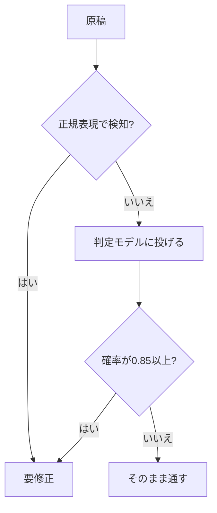

# 正規表現で足りる？"判定専用"AIモデルを試してみた

読み上げ用に書き出した原稿に、うっかり英単語が1つ混ざっていたことはありませんか。

私はこれで、合成音声がそこで不自然に読み上げてしまう事故を何度かやりました。

「日本語に英語が混ざっていないか」を判定したいだけなのに、意外と厄介です。

手で全部を確認するのは現実的でなく、正規表現で弾くのが定番だと思います。

そんな折、respan というサービスが「判定のためのモデル」を出しているのを知りました。

これなら先ほどの悩みも楽になるのでは、と思って実際に試してみました。

この記事はその記録です。結論から言うと、期待したほどではありませんでした。

使ったコードと実測データは、こちらに置いています。

```
https://github.com/sunnydachs/span01-eval
```

## 先に結論

**多くの場面では、正規表現で足ります。**

今回試した「判定専用」のモデルは、指示文の書き方で結果が大きく変わります。

指示文さえうまく書けば賢いのですが、正規表現を明確に上回ることはありませんでした。

同じことは、無料の汎用チャットモデルでもできてしまいます。

ただし「どんなときに使うと得か」は、データを見ると意外とすっきりしました。

判定を丸投げするのではなく、正規表現に足す補助として使うのが良さそうです。

## そもそも、これは何か

respan が提供している、少し変わったタイプのモデルです。

公式サイトはこちらです。

- respan: https://www.respan.ai/

対象にしたのは span-01 と span-01-lite というモデルです。

これは文章を生成するチャットモデルではありません。

**「ある条件に当てはまるかを、確率で返す」**モデルです。

自然文で「何を判定したいか」を定義して投げると、0〜1の確率が返ってきます。

分類器を、学習させずにプロンプトだけで作れる、という位置づけです。

> 判定のルールを、コードの中ではなく、日本語で書ける。
> これがこのモデルの売りだと、私は理解しました。

## 使えそうだと思った悩み

冒頭の悩みは、まさにこの形に当てはまりそうです。

やりたいのは「日本語の原稿に英語が混ざっていないか」の判定です。

従来のやり方は正規表現でした。実際、よく動きます。

ただし、静かに壊れる場所があります。

- 英単語が1つだけ、日本語に直接くっついている場合（取りこぼす）
- 逆に、ブランド名や人名、コード片を誤って検知する

この「取りこぼし」と「誤検知」を、
自然文で定義できるモデルなら減らせるのでは、と考えました。

## 実際に試してみた

思いつきではなく、比較できる形で測りました。

準備したデータは、2種類です。

1つ目は、境界線ぎりぎりの文を自分で作った合成スイート（23件）です。

英語の単語、英語の文、カタカナ語、ブランド名、人名、
URL、略語、コード片、ロール名を、1件ずつ並べました。

2つ目は、実際の日本語原稿です。約200件あります。

そのうち英字を含むものを全部と、含まないものを一部抜き出しました。

比べたのは、この3つです。

```
  [ 日本語の原稿 ]
        │
        ├─ 正規表現 ────── 決定的・0円・0秒
        ├─ 判定モデル ──── 自然文で定義 → 確率
        └─ 汎用チャット ── YES/NO で答えさせる
```

呼び出しは合計200回あまり。課金は0円で、レート制限にも当たりませんでした。

## 結果

先に、合成スイート23件での成績です。

F1 は「取りこぼし」と「誤検知」を1つにまとめた指標で、1.0が満点です。

- 正規表現 ─────────────── F1 0.90

- 判定モデル（指示文が曖昧） ──── F1 0.67

- 判定モデル（除外を明示） ───── F1 0.82

- **判定モデル（指示文を書き切る） ── F1 0.93**

- 無料の汎用チャットモデル ───── F1 1.00

実際の原稿約200件では、こうなりました。

- 正規表現 ──── 22件中 22件を検知
- 判定モデル ── 22件中 21件を検知

つまり**実データでは、正規表現のほうが上**でした。

合成スイートではモデルが僅かに勝ちますが、差は誤差の範囲です。

## いちばん驚いたこと

面白かったのは、精度ではなく**指示文の影響力**でした。

同じ「日本語に英単語が1つ混ざった文」でも、
指示文の書き方だけで、結果が反転します。

```
 「英単語が混ざっている」とだけ指示
   このmethodはやばい   →  確率 0.06   見逃し

 「単一の英単語も数える」と明示
   このmethodはやばい   →  確率 0.81   検知
```

さらに、指示に従わない場面もありました。

「すべての英字を検知せよ」と書いても、
ブランド名やURLは、なぜか除外され続けます。

モデルの中にある「これは除外してよさそう」という前提は、
指示文では完全には上書きできない、ということです。

> 自然文で定義できる、というのは諸刃の剣でした。
> 書けば書くほど良くなる。書かないと、静かに見逃す。

## 確信度は、どこまで信用できるか

このモデルは確率を返すので、閾値の置き場所が重要になります。

返ってきた確率と、実際の正解率がどれだけ合っているかを調べました。

```
 確率 0.00〜0.15  ████████████████  よく合う（低い側）
 確率 0.15〜0.85  ░░░░░░░░░░░░░░░░  中間は薄く、外れる
 確率 0.85〜1.00  ████████████████  よく合う（高い側）
```

両端はよく合っています。実務で使うのは、この両端の領域です。

中間帯は「どちらとも言えない」と受け取るのが安全でした。

なので閾値は0.5の1本ではなく、
0.15と0.85の2本で判断する形が良さそうです。

## 正直な限界

- 合成スイートは23件のみで、各1回だけの測定です。

- 正解ラベルは、私の主観を混ぜたゆるめの基準です。

- 検証したのは日本語への英語混入だけで、他の言語は未検証です。

- 有料の span-01 本体は手元で試せず、span-01-lite のみの結果です。

## まとめ: どう使うか

結論は、最初に書いたとおりです。

**正規表現を第一段に置き、判定モデルは補助に使う。**

判定の流れにすると、こうなります。



この形の利点は、次の3つです。

- 決定性と0円を、正規表現の段で確保できる

- モデルには「複数語の英語」のような、苦手な部分だけを任せられる

- モデルを差し替えても、判定全体は壊れない

逆に、判定を全部モデルに任せるのはおすすめしません。

今回の結果では、コストを払って精度が下がるだけでした。

無料の汎用チャットモデルでも、同じことはできます。

ただし「除外ルールを日本語で書ける」という性質は、
正規表現では表現しづらい条件を扱うときに効いてきそうです。

そういう悩みがあるなら、試す価値はあると思います。

最後にもう一度、置き場所を載せておきます。

```
https://github.com/sunnydachs/span01-eval
```

これは製品ではなく検証記録なので、内容に保証はありません。

同じ用途で試した人がいれば、結果を教えてもらえると嬉しいです。
